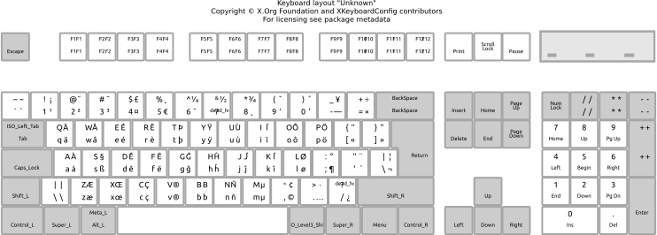

# xkb-usfr

## Description

This is a keyboard layout for xkb, inspired from the _English (international AltGr dead keys)_ layout, with all the french letters with diacritics directly available. With the original layout, some letters, like _èàùôê_ were noot writable without using dead keys.



## Installation

```bash
git clone https://github.com/Araxor/xkb-usfr
cd xkb-usfr
./install.sh
```

## Activation

```bash
setxkbmap 'usfr'
```
   
